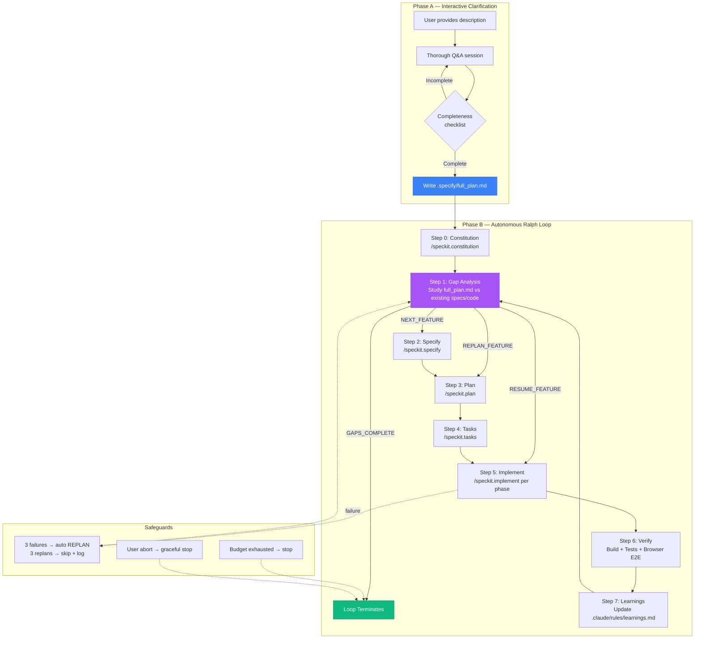
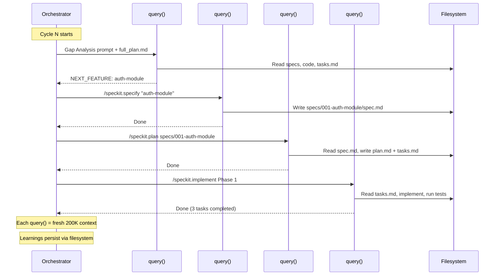
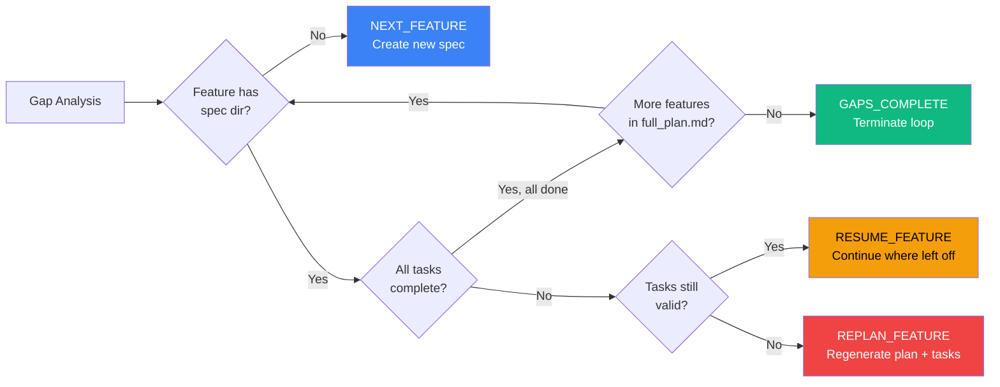
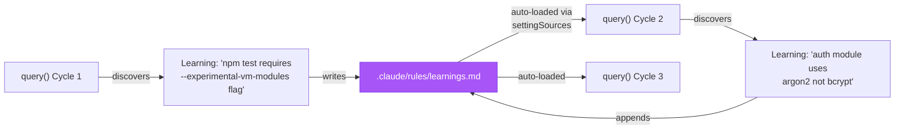
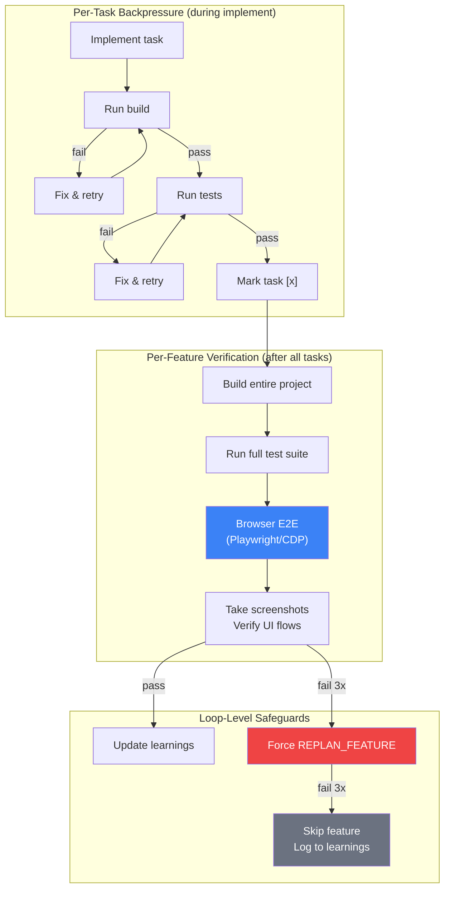
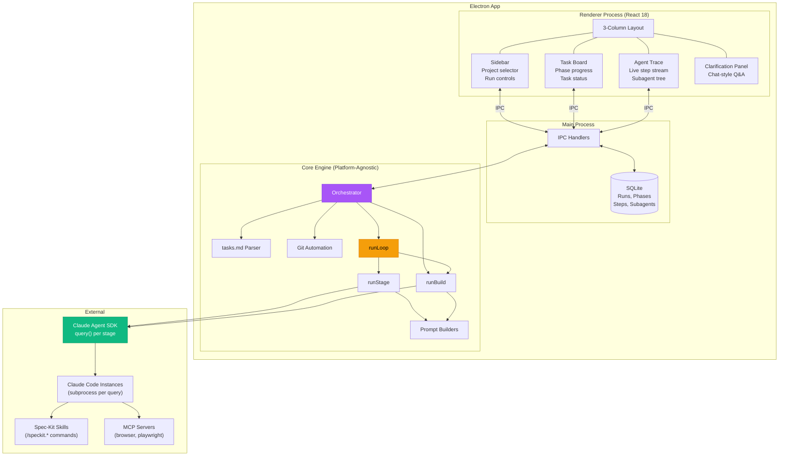
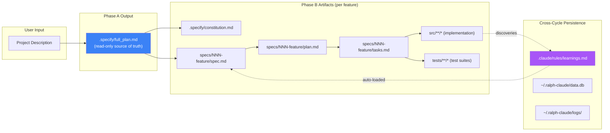
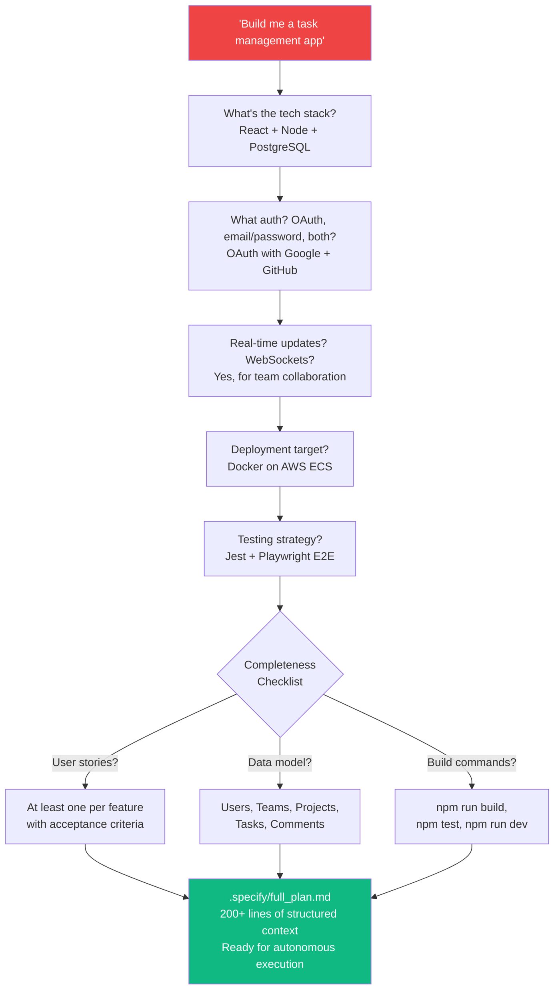

# Ralph-Claude: Autonomous Software Engineering at Scale

## The Problem

AI coding assistants today operate in one of two modes: **interactive** (human drives every prompt) or **single-shot** (one task, one context window, done). Neither scales to building real software — projects with dozens of features, thousands of files, and days of work.

The fundamental challenges:

1. **Context window exhaustion** — A 200K token window fills fast. After ~100K tokens of accumulated tool calls, code reads, and reasoning, the model enters a "dumb zone" where output quality degrades. Long-running sessions produce increasingly poor code.

2. **No persistent memory across sessions** — Each new conversation starts from zero. The agent re-discovers project structure, re-reads the same files, and makes the same mistakes it already learned to avoid.

3. **No structured planning** — Agents jump straight to implementation. Without a specification-first workflow, features are incomplete, inconsistent, and don't compose well across a multi-feature project.

4. **No verification beyond "it compiles"** — Most AI workflows stop at `tsc --noEmit` or `npm test`. Nobody checks if the feature actually works in a browser, if the UI renders correctly, or if the user flow makes sense.

5. **No recovery from failure** — When an agent gets stuck or produces bad code, the only option is human intervention. There's no automatic re-planning, no failure tracking, no self-correction loop.

6. **No cost or progress visibility** — The agent runs in a terminal. You watch scrolling text and hope for the best. No dashboards, no phase tracking, no cost attribution.

## The Three Pillars

Ralph-Claude synthesizes three independent innovations into a unified system:

```mermaid
graph TB
    subgraph "Ralph Wiggum"
        RW[Infinite Loop Philosophy]
        RW1[Context Isolation per Task]
        RW2[Self-Improvement via AGENTS.md]
        RW3[Numbered Guardrails]
        RW4[Subagent Parallelism Control]
    end

    subgraph "GitHub Spec-Kit"
        SK[Specification-Driven Development]
        SK1[Structured Spec Templates]
        SK2[Constitution / Project Principles]
        SK3[Phased Execution: specify → plan → tasks → implement]
        SK4[Multi-Agent Support]
    end

    subgraph "Claude Agent SDK"
        AS[Programmatic Agent Control]
        AS1["query() API with Typed Hooks"]
        AS2[Session & Abort Management]
        AS3[MCP Server Integration]
        AS4[settingSources for Config Loading]
    end

    RW --> RC[Ralph-Claude]
    SK --> RC
    AS --> RC

    style RC fill:#a855f7,stroke:#7c3aed,color:#fff
    style RW fill:#f59e0b,stroke:#d97706,color:#000
    style SK fill:#3b82f6,stroke:#2563eb,color:#fff
    style AS fill:#10b981,stroke:#059669,color:#fff
```



### Pillar 1: Ralph Wiggum — The Loop Philosophy

[Ralph Wiggum](https://ghuntley.com/ralph/) by Geoffrey Huntley is a deceptively simple idea: run `while :; do cat PROMPT.md | claude ; done` in a bash loop. Each iteration gets a fresh context window, picks the most important task, implements it, commits, and exits. The loop restarts. Over hours and days, the project converges toward completeness through iteration.

**Key insights we inherit:**
- **Context isolation** — fresh context per unit of work prevents quality degradation
- **Self-improvement** — `AGENTS.md` accumulates operational learnings across iterations
- **"Signs" system** — numbered guardrails (999, 9999, 99999...) enforce invariants with escalating priority
- **Subagent control** — 500 parallel subagents for reads, 1 for builds (backpressure)
- **Trust the loop** — eventual consistency through iteration, not perfection per step

**What Ralph lacks:** No UI, no structured specs, no programmatic control, no abort, no cost tracking, no recovery logic. It's a bash script.

### Pillar 2: GitHub Spec-Kit — Structured Planning

[Spec-Kit](https://github.com/github/spec-kit) by GitHub implements Specification-Driven Development (SDD) — specs are the primary artifact, code is generated output. It provides a templated workflow:

```
/speckit.constitution → /speckit.specify → /speckit.plan → /speckit.tasks → /speckit.implement
```

Each command produces structured artifacts:

| Artifact | Purpose |
|----------|---------|
| `constitution.md` | Immutable project-wide principles |
| `spec.md` | Feature specification with user stories, acceptance criteria |
| `plan.md` | Technical implementation plan, architecture decisions |
| `research.md` | Technology decisions and rationale |
| `data-model.md` | Entities, relationships, schemas |
| `contracts/` | API contracts, interface definitions |
| `tasks.md` | Dependency-ordered, actionable task list |

**Key insights we inherit:**
- **Specs before code** — forces thorough thinking before implementation
- **Constitution** — project-wide constraints that shape all feature specs consistently
- **Phased execution** — each phase has focused scope, testable output
- **Acceptance-driven testing** — tests derived from acceptance criteria, not invented ad-hoc

**What Spec-Kit lacks:** No autonomous loop, no gap analysis, no failure recovery, no self-improvement. It's a sequential workflow that requires human orchestration.

### Pillar 3: Claude Agent SDK — Programmatic Control

The [Claude Agent SDK](https://github.com/anthropics/claude-agent-sdk-typescript) provides programmatic access to Claude Code instances via the `query()` API:

```typescript
const result = await query({
  prompt: "implement the auth module",
  options: {
    allowedTools: ["Read", "Write", "Edit", "Bash"],
    settingSources: ["project"],
    maxTurns: 200,
    hooks: { PreToolUse: [...], PostToolUse: [...] }
  }
});
```

**Key insights we inherit:**
- **Typed hooks** — intercept every tool call, subagent spawn, and completion event
- **Session management** — resume, fork, and abort running agents
- **`settingSources`** — automatically loads `.claude/rules/` including learnings from prior iterations
- **MCP integration** — browser automation, playwright, custom tools
- **AbortController** — graceful mid-phase cancellation

**What the SDK lacks:** No loop, no planning, no specs, no UI. It's a library.

## The Synthesis: Ralph-Claude

Ralph-Claude combines these three pillars into an autonomous software engineering system that can take a vague description and build a complete project over hours or days — without human intervention.



### How Context Isolation Works

Every box in the loop above is a **separate `query()` call** — a fresh Claude Code instance with a clean 200K context window. This is the core Ralph Wiggum insight, implemented programmatically:



State doesn't pass through the context window — it passes through the **filesystem**. Specs, tasks, code, and learnings are written to disk. Each new `query()` reads what it needs from disk, operates in the "smart zone" of its context window, and writes results back. This is how Ralph Wiggum achieves eventual consistency: not by remembering everything, but by reading the current state each time.

### The Four-Way Gap Analysis

The gap analysis stage is the loop's brain. It reads `full_plan.md` (the user's original intent) and compares it against the current state of specs and code, then outputs exactly one decision:



This handles the full feature lifecycle: creation, resumption after crash, recovery from bad plans, and graceful termination. Ralph Wiggum's bash loop can only create and continue — it can't detect when a plan is wrong and needs regeneration.

### Self-Improvement Loop

Learnings accumulate in `.claude/rules/learnings.md` and are automatically loaded by every subsequent `query()` call via the SDK's `settingSources: ["project"]` mechanism:



This is functionally identical to Ralph Wiggum's `AGENTS.md` updates, but uses the SDK's native config loading instead of explicit file reads in the prompt.

### Backpressure Architecture

Multiple layers of verification prevent the agent from claiming work is done when it isn't:



Key innovation over Ralph: **browser-based E2E verification**. Ralph only runs build + typecheck. Ralph-Claude opens the app in a browser (via MCP tools), walks user flows, takes screenshots, and verifies the UI actually works. This catches an entire class of bugs — rendering issues, broken interactions, missing styles — that compile-and-test backpressure misses.

### Acceptance-Driven Test Derivation

Tests aren't invented ad-hoc. They flow from acceptance criteria through the spec-kit pipeline:


This creates a traceable chain from "what the user wants" to "what the tests verify." An agent can't mark a task complete without implementing and passing the tests derived from its acceptance criteria.

## Architecture

### System Architecture



### Core Engine Design

The core engine (`src/core/`) is **platform-agnostic** — pure Node.js with no Electron imports. It can be tested standalone, embedded in a CLI, or run as a service. The Electron app is just one possible frontend.

Three execution modes:

| Mode | Entry Point | Use Case |
|------|------------|----------|
| `build` | `runBuild()` | Implement existing specs (single pass) |
| `plan` | `runBuild()` | Generate plans for existing specs |
| `loop` | `runLoop()` | Full autonomous loop (Phase A + B) |

### Data Flow



Key design decision: **`full_plan.md` is immutable**. The loop never modifies it. It captures the user's original intent from Phase A. Individual feature specs (derived from it) are mutable — they can be replanned, rewritten, and iterated on. This prevents drift from user intent while allowing the loop to self-correct at the feature level.

## Why This Approach Is Superior

### vs. Interactive AI Coding (Cursor, Copilot, Claude Code manual)

| Dimension | Interactive | Ralph-Claude |
|-----------|------------|--------------|
| **Scale** | One task at a time, human-driven | Dozens of features, autonomous |
| **Context** | Single session, degrades over time | Fresh context per stage, always in "smart zone" |
| **Planning** | Ad-hoc or none | Structured specs with acceptance criteria |
| **Verification** | Manual | Automated build + test + browser E2E |
| **Recovery** | Human restarts | Auto-replan after 3 failures |
| **Cost visibility** | None | Per-phase cost/duration tracking |
| **Time to complete** | Hours of human attention | Runs overnight, report in the morning |

### vs. Original Ralph Wiggum

| Dimension | Ralph Wiggum | Ralph-Claude |
|-----------|-------------|--------------|
| **Interface** | Bash script, watch terminal | Desktop app with live trace |
| **Planning** | Free-form TODO list | Spec-kit: spec → plan → tasks pipeline |
| **Specs** | `specs/*.md` (unstructured) | Templated: spec.md + plan.md + tasks.md + data-model.md + contracts/ |
| **Scope** | One task per iteration | One feature per cycle (all phases) |
| **Gap analysis** | Linear: "pick next task" | Four-way: NEXT / RESUME / REPLAN / COMPLETE |
| **Recovery** | Manual: delete plan, re-run | Automatic: 3 failures → replan → 3 replans → skip |
| **Verification** | Build + typecheck | Build + tests + browser E2E |
| **Clarification** | Assumes correct specs upfront | Interactive Phase A with completeness checklist |
| **Constitution** | None | Project-wide principles shape all specs |
| **Persistence** | Git only | SQLite + structured logs + git |
| **Abort** | Kill the terminal | AbortController with graceful cleanup |
| **Cost tracking** | None | Per-phase cost/duration attribution |

### vs. Other Agent Frameworks (Devin, SWE-Agent, OpenHands)

| Dimension | Agent Frameworks | Ralph-Claude |
|-----------|-----------------|--------------|
| **Context strategy** | Single long session | Fresh context per stage (Ralph philosophy) |
| **Planning depth** | Varies, usually shallow | Spec-kit's full specify → plan → tasks pipeline |
| **Self-improvement** | None across sessions | learnings.md persists across all future stages |
| **Verification** | Usually just tests | Tests + browser-based E2E + screenshots |
| **Failure recovery** | Retry or give up | Structured replan with failure tracking |
| **Transparency** | Opaque or log-only | Real-time UI with step-by-step trace |
| **Local-first** | Cloud-hosted (Devin) or CLI | Desktop app, your machine, your data |
| **Spec integration** | None | Native spec-kit with constitution |

## Key Innovation: Interactive Clarification

Neither Ralph Wiggum nor any other autonomous coding approach solves the **specification quality problem**: garbage in, garbage out. If the agent starts with a vague description, it builds the wrong thing — and burns budget doing it.

Ralph-Claude's Phase A is a thorough interactive session that transforms a vague idea into a comprehensive plan:



The completeness checklist ensures the plan has everything needed for autonomous execution:
- At least one user story with acceptance criteria per feature
- Technology stack with specific versions
- Build, test, and dev server commands
- Deployment target
- Testing strategy with specific tools
- Data model overview

Only when all items are covered does Phase B begin. This front-loads the human effort into a 30-minute clarification session, then the loop runs for hours without needing input.

## Summary

Ralph-Claude is the convergence of three ideas:

1. **Ralph Wiggum's loop philosophy** — context isolation, self-improvement, eventual consistency through iteration
2. **Spec-Kit's structured planning** — specifications before code, constitution-governed, acceptance-driven testing
3. **Claude Agent SDK's programmatic control** — typed hooks, abort management, MCP integration, session control

The result: a desktop application that takes a project description, clarifies it into a complete plan, and autonomously builds, verifies, and iterates — feature by feature, phase by phase — with fresh context windows, structured specs, browser-based verification, automatic failure recovery, and real-time visibility into every step.


