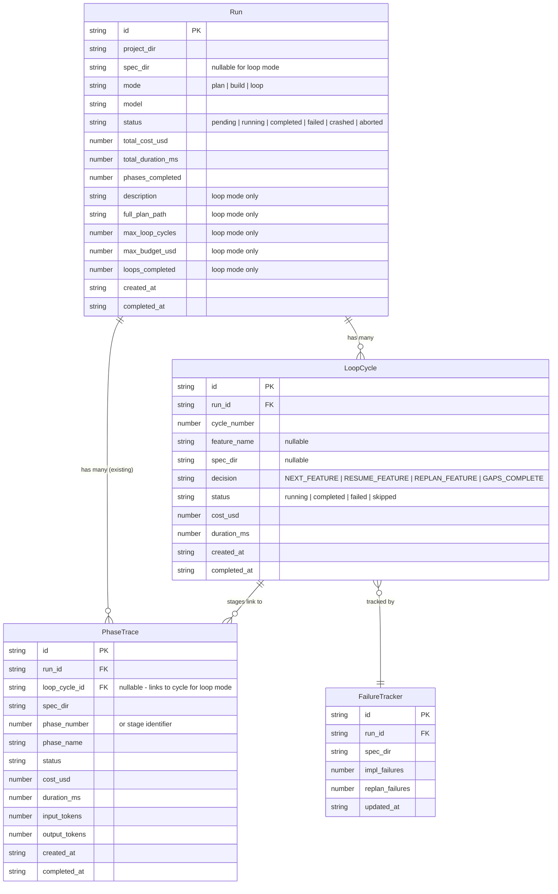

# Data Model: Autonomous Ralph Loop

**Feature**: 001-autonomous-ralph-loop | **Date**: 2026-04-15

## Entity Diagram



## Type Definitions (TypeScript)

### Extended RunConfig

```typescript
interface RunConfig {
  projectDir: string;
  specDir: string;                    // Existing — used for plan/build modes
  mode: "plan" | "build" | "loop";   // Extended with "loop"
  model: string;
  maxIterations: number;
  maxTurns: number;
  phases: number[] | "all";
  runAllSpecs?: boolean;

  // Loop-mode fields (all optional, only relevant when mode === "loop")
  description?: string;               // Text description for clarification
  descriptionFile?: string;            // File path alternative to text
  fullPlanPath?: string;               // Path to existing full_plan.md (skip Phase A)
  maxLoopCycles?: number;              // Termination: max cycles (default: unlimited)
  maxBudgetUsd?: number;               // Termination: max cost in USD (default: unlimited)
}
```

### Loop Stage Types

```typescript
type LoopStageType =
  | "clarification"
  | "constitution"
  | "gap_analysis"
  | "specify"
  | "plan"
  | "tasks"
  | "implement"
  | "verify"
  | "learnings";

interface LoopStage {
  type: LoopStageType;
  specDir?: string;           // Which spec this stage operates on
  phaseNumber?: number;       // For implement stage (runs per phase)
  startedAt: string;
  completedAt?: string;
  costUsd: number;
  durationMs: number;
  result?: string;            // Raw output from query()
}
```

### Gap Analysis Result

```typescript
type GapAnalysisDecision =
  | { type: "NEXT_FEATURE"; name: string; description: string }
  | { type: "RESUME_FEATURE"; specDir: string }
  | { type: "REPLAN_FEATURE"; specDir: string }
  | { type: "GAPS_COMPLETE" };
```

### Loop Cycle

```typescript
interface LoopCycle {
  id: string;
  runId: string;
  cycleNumber: number;
  featureName: string | null;
  specDir: string | null;
  decision: GapAnalysisDecision;
  stages: LoopStage[];
  status: "running" | "completed" | "failed" | "skipped";
  costUsd: number;
  durationMs: number;
  startedAt: string;
  completedAt?: string;
}
```

### Failure Tracker

```typescript
interface FailureRecord {
  specDir: string;
  implFailures: number;      // Reset to 0 on successful implementation
  replanFailures: number;    // Reset to 0 on successful re-plan
}
```

### Loop Termination

```typescript
type TerminationReason =
  | "gaps_complete"
  | "budget_exceeded"
  | "max_cycles_reached"
  | "user_abort";

interface LoopTermination {
  reason: TerminationReason;
  cyclesCompleted: number;
  totalCostUsd: number;
  totalDurationMs: number;
  featuresCompleted: string[];
  featuresSkipped: string[];
}
```

## New Orchestrator Events

```typescript
// Phase A events
| { type: "clarification_started"; runId: string }
| { type: "clarification_question"; runId: string; question: string }
| { type: "clarification_completed"; runId: string; fullPlanPath: string }

// Phase B cycle events
| { type: "loop_cycle_started"; runId: string; cycleNumber: number }
| { type: "loop_cycle_completed"; runId: string; cycleNumber: number; decision: string; featureName: string | null }

// Stage events (within a cycle)
| { type: "stage_started"; runId: string; cycleNumber: number; stage: LoopStageType; specDir?: string }
| { type: "stage_completed"; runId: string; cycleNumber: number; stage: LoopStageType; costUsd: number }

// Termination
| { type: "loop_terminated"; runId: string; termination: LoopTermination }
```

## SQLite Schema Changes

### New Tables

```sql
CREATE TABLE IF NOT EXISTS loop_cycles (
  id TEXT PRIMARY KEY,
  run_id TEXT NOT NULL REFERENCES runs(id),
  cycle_number INTEGER NOT NULL,
  feature_name TEXT,
  spec_dir TEXT,
  decision TEXT NOT NULL,
  status TEXT NOT NULL DEFAULT 'running',
  cost_usd REAL DEFAULT 0,
  duration_ms INTEGER DEFAULT 0,
  created_at TEXT NOT NULL,
  completed_at TEXT
);

CREATE INDEX idx_loop_cycles_run ON loop_cycles(run_id);

CREATE TABLE IF NOT EXISTS failure_tracker (
  id TEXT PRIMARY KEY,
  run_id TEXT NOT NULL REFERENCES runs(id),
  spec_dir TEXT NOT NULL,
  impl_failures INTEGER DEFAULT 0,
  replan_failures INTEGER DEFAULT 0,
  updated_at TEXT NOT NULL
);

CREATE INDEX idx_failure_tracker_run ON failure_tracker(run_id);
CREATE UNIQUE INDEX idx_failure_tracker_spec ON failure_tracker(run_id, spec_dir);
```

### Modified Tables

```sql
-- runs table: add loop-mode columns
ALTER TABLE runs ADD COLUMN description TEXT;
ALTER TABLE runs ADD COLUMN full_plan_path TEXT;
ALTER TABLE runs ADD COLUMN max_loop_cycles INTEGER;
ALTER TABLE runs ADD COLUMN max_budget_usd REAL;
ALTER TABLE runs ADD COLUMN loops_completed INTEGER DEFAULT 0;

-- phase_traces table: add loop_cycle linkage
ALTER TABLE phase_traces ADD COLUMN loop_cycle_id TEXT REFERENCES loop_cycles(id);
```

## State Transitions

### Loop Lifecycle

```
IDLE → CLARIFYING → LOOPING → TERMINATED
                      ↑          |
                      └──────────┘ (next cycle)
```

### Per-Cycle State Machine

```
gap_analysis → NEXT_FEATURE → specify → plan → tasks → implement → verify → learnings → (next cycle)
             → RESUME_FEATURE ─────────────────────────→ implement → verify → learnings → (next cycle)
             → REPLAN_FEATURE ──────────→ plan → tasks → implement → verify → learnings → (next cycle)
             → GAPS_COMPLETE → terminate
```

### Failure Recovery State Machine

```
implement_failed (count < 3) → retry implement
implement_failed (count = 3) → force REPLAN_FEATURE → plan → tasks → implement
replan_failed (count < 3)    → retry replan cycle
replan_failed (count = 3)    → SKIP feature → log to learnings.md → next cycle
```

## Validation Rules

- `RunConfig.mode === "loop"` requires at least one of: `description`, `descriptionFile`, or `fullPlanPath`
- `maxLoopCycles` and `maxBudgetUsd` are optional; if both omitted, loop runs until `GAPS_COMPLETE` or user abort
- `specDir` is empty string for loop mode (orchestrator discovers/creates specs dynamically)
- `LoopCycle.decision` must be one of the four `GapAnalysisDecision` types
- `FailureRecord` counters are non-negative integers, reset to 0 on success
- `full_plan.md` path must exist before Phase B starts
